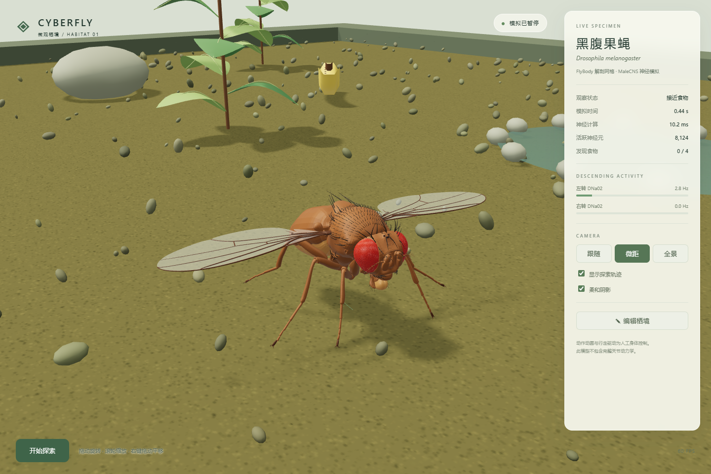
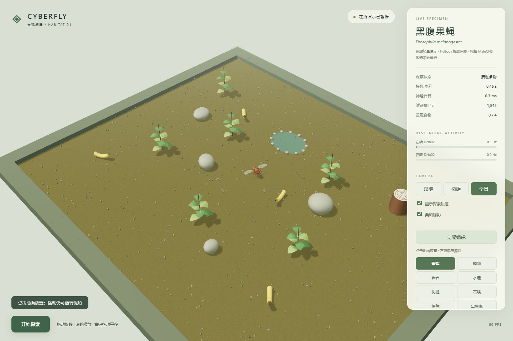
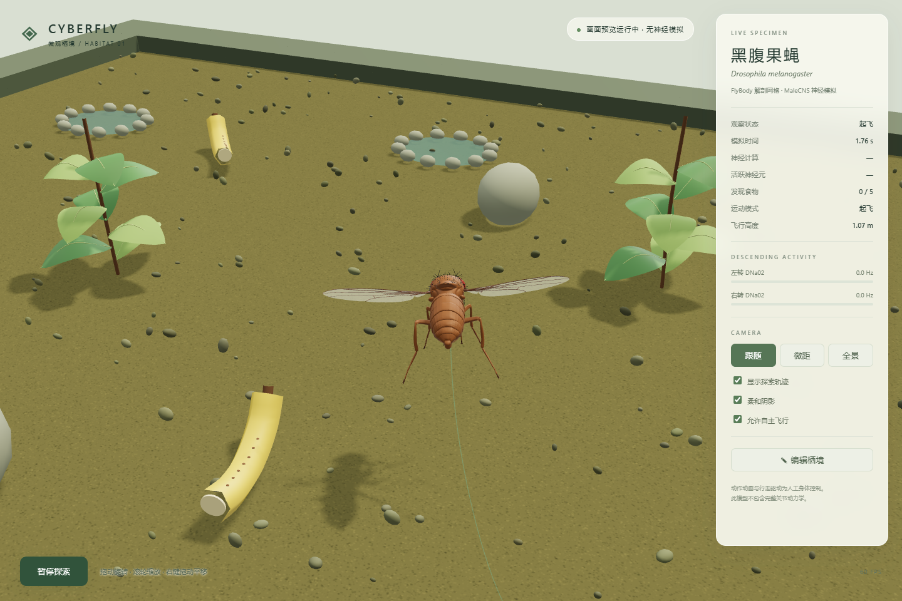

# Cyberfly Explorer

一只由 MaleCNS 神经模型驱动的果蝇，在 Three.js / WebGL 三维栖境中探索。浏览器在本机运行画面，Python 在本机 CPU 上计算神经活动。

**[直接体验网页版](https://chenyvhang.github.io/cyberfly-explorer/)** — 无需安装。在线版使用浏览器内轻量控制器；本地版保留完整 166,700 神经元 MaleCNS 模型。

## 在线体验

- [Cyberfly Explorer｜果蝇成虫](https://chenyvhang.github.io/cyberfly-explorer/)
- [CyberLarva｜果蝇幼虫](https://chenyvhang.github.io/cyber-larva/)







## 当前版本

- Three.js 实时透视渲染、物理材质、环境照明、柔和阴影、雾与抗锯齿
- FlyBody 真实网格转制的 `assets/flybody.glb`，85 个网格、153 个层级节点，约 23 MB
- 实际几何体：复眼、刚毛、翅膜、翅脉、腿节、触角和腹节；21 个命名部件以程序动画驱动
- 跟随、微距、全景相机，可以任意旋转、缩放和平移
- 地面爬行与三维飞行双模式：自主起飞、爬升、巡航、空中避障、目标接近与降落
- 飞行状态包含高度、垂直速度、俯仰和横滚；第三视角会随三维位置及航向连续追踪
- 泥土表面、石块、带叶脉的植物、香蕉、树桩年轮和水洼；850 个碎石用实例化绘制
- 原 MaleCNS 数据含 166,700 个神经元、25,582,938 条连接，运行时沿用 `flybrain` 的感觉输入修正配置，详见科学边界
- LC4/LPLC2 威胁输入、LC10a 目标输入、DM1/DM2 食物气味输入
- DNa02 转向、DNp01 逃逸、DNg100/MDN 前后运动读出
- 中文控制面板、神经读数、探索轨迹和可保存的三维地图编辑器

## 安装

在 PowerShell 中进入本文件夹，运行：

```powershell
.\setup.ps1
```

安装需要 Python 3.10+ 和 Node.js/npm。当前机器的依赖、Three.js、GLB 和脑数据均已布设好。重新安装时需要联网；运行时三维引擎与模型均从项目本地加载，不依赖 CDN。预编译脑数据约 260 MB，保存在 `data/male-cns`。

## 启动

**双击 `start-3d.cmd`**，自动打开本地浏览器。也可以在 PowerShell 运行：

```powershell
.\run-brain.ps1
```

仅检查画面、不加载神经模型：

```powershell
.\run-preview.ps1
```

服务地址为 `http://127.0.0.1:8765`，仅在本机监听。若服务已在运行，直接打开地址，不要重复启动。退出时在启动窗口按 Ctrl+C；关闭网页会保留服务，结束实验前先点击暂停。

启动后默认暂停。预热完成后点击“开始探索”。渲染与神经计算独立；神经模拟使用固定 20 ms 步长，计算跟不上时模拟时间变慢，不通过加快身体移动来补偿。首次运行 Numba 可能需要十余秒预热。

鼠标拖动旋转，滚轮缩放，右键拖动平移。右侧选择“跟随 / 微距 / 全景”。可关闭阴影降低集显负载。旧 Pygame 版本保留在 `app.py`，启动脚本现在默认进入真正三维版本。

## 可视化地图编辑器

点击“编辑栖境”自动暂停。选择香蕉、植物、岩石、水洼、树桩、石墙、擦除或出生点，然后在三维地面单击放置；右键单击擦除，拖动相机不触发放置。

点击“保存”写入项目的 `maps/custom_map.json`，以后启动时自动载入；“载入”恢复存档；“自然栖境”恢复默认环境但不覆盖存档。完成编辑后点击“开始探索”。旧版本保存的地图仍可加载。

## 科学边界

感觉编码、LIF 参数和运动解码均是模型假设。现有 `BrainController` 使用 `sensory_input=False`：按上游实现移除指向感觉神经元的连接，抑制其自激回路。因此不能称运行图的每条边均保持原样。基准输出中的 25,582,938 是原始数据规模。

身体有基础前进驱动、人工碰撞转向，以及靠近食物后的停留逻辑。前端关节动画为艺术性行走/翅膀/头部动画，不是从脑活动逐关节推导的动作。环境运动目前约束在地面平面；三维渲染包含实际几何和深度，但未接入 MuJoCo 的关节物理、飞行或学习验证。GLB 的视觉身体大小为观察方便经过缩放。

## 验证与模型重建

`tools/verify3d.mjs` 使用本机 Edge 无头模式检查 GLB 加载、真实脑启动/暂停、三维地图增删和渲染错误，并保存运行截图。`tools/convert_flybody.py` 可从上游 OBJ/MJCF 重新构建 GLB。模型来源、固定版本及修改记录见 `assets/MODEL-SOURCE.md`。

## 来源与许可

- `flybrain`：MIT License，<https://github.com/alextitonis/fly.ai>
- MaleCNS v1.0 数据：CC BY 4.0，<https://male-cns.janelia.org>
- FlyBody 网格：Apache-2.0，<https://github.com/TuragaLab/flybody>；许可保存在 `assets/FlyBody-LICENSE`
- Three.js：MIT License，<https://threejs.org/>
- 本项目代码：MIT License
